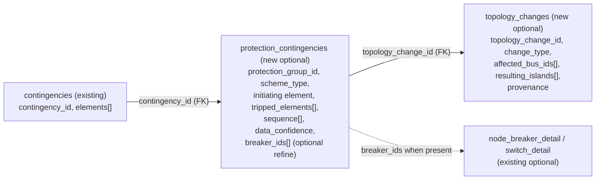

<!--
Raptrix CIM-Arrow — High-performance open CIM profile by Raptrix Power
Copyright (c) 2026 Raptrix Power
-->

# ADR 0001: Protection-Informed Contingencies and Post-Event Topology Metadata

- **Status**: Proposed (Phase 0 — open contract)
- **Target contract**: RPF v0.11.0 (additive, optional tables)
- **Scope**: `raptrix-cim-rs` / `raptrix-cim-arrow` only. No closed-core solver changes.
- **Supersedes / amends**: extends the v0.10.0 locked contract in `docs/schema-contract.md`.

## 1. Context

Real control-room contingencies are rarely clean single-branch outages. Protection
schemes clear faults by tripping groups of equipment — often "a relay/breaker action
strings up to ~10 pieces of equipment", with breaker-failure backup, bus-differential
lockout, transfer trip, and automatic sequences. These actions frequently cause
**bus splits, partial substation isolation, or island formation**. They are not edge
cases; they are how the grid actually clears faults and how operators reason about risk.

The current `.rpf` contract (v0.10.0) is a pure bus-branch interchange. It can represent
single- and multi-element branch/machine/load/shunt outages via the existing
`contingencies.elements` list, but it carries **no protection context** and **no
representation of the resulting topology change**. A numerically converged solve on the
wrong post-contingency topology is still physically wrong, which erodes control-room trust
and weakens differentiation versus EMS contingency processors and modern node-breaker tools.

### Architectural tension we must resolve

- Keep the **commercial solver core separate** from the open interchange contract (hot-start
  cloning and zero-copy paths stay in the closed product). The core Newton-Raphson engine
  must not change in this repository.
- Keep the **`.rpf` format rich and open** (adoption vehicle). The schema is the durable
  contract that external tools and the closed core target.
- Support protection-informed and topology-changing contingencies **without forcing every
  file to carry full node-breaker data** — most utilities will not provide complete
  protection models on day one.

### Two relevant facts about the existing contract (verified in-repo)

1. `contingencies.elements` is already a `List<Struct>` (see `contingencies_elements_type()`
   in `raptrix-cim-arrow/src/schema.rs`). **Compound multi-element outages are already
   representable.** The net-new work is *protection context* and *post-event topology*, not
   "compound contingencies".
2. `contingencies.elements.element_type` is `Dictionary<Int32,Utf8>` (open wire type).
   Adding vocabulary tokens is a documentation change, not a wire-shape change.

## 2. Decision

Introduce **two additive, optional Arrow tables** behind feature flags, using a **layered
model**: a *logical protection-group baseline* that works on existing bus-branch data, with
*optional breaker-level fields* that refine it when node-breaker detail is available.

- `protection_contingencies` — protection context and the resulting declared outage set,
  keyed to an existing `contingencies.contingency_id`.
- `topology_changes` — the resulting (or, later, solved) topology delta.

Both tables follow the established optional-table machinery used by `facts_devices`,
`scenario_context`, and `computational_load_profiles`:

- opt-in via a `RootWriteOptions` flag,
- advertised by a `raptrix.features.*` file-metadata key,
- appended as trailing root columns after the 18 required tables,
- resolvable via `table_schema(name)` but **not** part of `all_table_schemas()`,
- ignored by older readers (forward-compatible additive change).



### Why layered (and not breaker-only)

- **Adoption / data reality**: the logical baseline requires only data a utility can produce
  from operator-facing protection/contingency lists (a named event → set of tripped
  elements → resulting bus split). It works today on bus-branch `.rpf` files.
- **Physical correctness path**: when `breaker_ids` + the existing optional
  `node_breaker_detail` / `switch_detail` tables are present, a future topology processor can
  recompute topology from switch states (Phase 2) rather than trusting a declared change.
- **Graceful degradation**: `data_confidence` lets producers be honest about whether the
  outage set is `modeled`, `inferred`, or `assumed`, and lets consumers log/warn accordingly.

## 3. Table designs (Arrow terms)

All dictionary-encoded strings use `Dictionary<Int32, Utf8>` consistent with the rest of the
contract. Lists/structs follow the existing nested-type conventions in `schema.rs`.

### 3.1 `protection_contingencies`

One row per protection-driven event.

| Column | Arrow type | Null | Meaning |
| --- | --- | --- | --- |
| `contingency_id` | Dictionary<Int32,Utf8> | required | FK to `contingencies.contingency_id` |
| `protection_group_id` | Dictionary<Int32,Utf8> | required | stable id of the protection scheme/group |
| `name` | Utf8 | nullable | human-readable label |
| `scheme_type` | Dictionary<Int32,Utf8> | required | open vocab (see below) |
| `initiating_equipment_kind` | Dictionary<Int32,Utf8> | nullable | kind of fault/trigger element |
| `initiating_equipment_id` | Dictionary<Int32,Utf8> | nullable | id of fault/trigger element |
| `tripped_elements` | List<Struct> | required | resulting outage set; **same struct shape** as `contingencies.elements` |
| `sequence` | List<Struct{ `step`:Int32, `delay_ms`:Float64, `equipment_kind`:dict, `equipment_id`:dict }> | nullable | automatic-sequence ordering/timing |
| `topology_change_id` | Int32 | nullable | FK to `topology_changes.topology_change_id` |
| `data_confidence` | Dictionary<Int32,Utf8> | required | `modeled` \| `inferred` \| `assumed` |
| `breaker_ids` | List<Utf8> | nullable | optional breaker-level refinement; references `switch_detail.switch_id` / `node_breaker_detail.switch_id` |
| `params` | Map<Utf8,Float64> | nullable | extensible scalar params |

`scheme_type` open vocabulary (recommended initial set): `breaker_failure`, `stuck_breaker`,
`relay_misoperation`, `bus_differential`, `zone_protection`, `line_protection`,
`transfer_trip`, `sympathetic_trip`, `auto_reclose`. Producers MAY emit other tokens;
consumers MUST tolerate unknown tokens.

Reusing the `contingencies.elements` struct shape for `tripped_elements` is deliberate: the
closed core's existing multi-element application logic can be reused directly on the outage
set with no new element parsing.

### 3.2 `topology_changes`

One row per resulting topology delta.

| Column | Arrow type | Null | Meaning |
| --- | --- | --- | --- |
| `topology_change_id` | Int32 | required | primary key |
| `contingency_id` | Dictionary<Int32,Utf8> | nullable | which contingency produced it |
| `change_type` | Dictionary<Int32,Utf8> | required | `bus_split` \| `island_formation` \| `substation_isolation` \| `partial_isolation` \| `element_isolation` |
| `affected_bus_ids` | List<Int32> | required | buses involved in the change |
| `resulting_islands` | List<Struct{ `island_index`:Int32, `bus_ids`:List<Int32>, `energized`:Boolean }> | nullable | islands formed by the change |
| `isolated_element_count` | Int32 | nullable | count of de-energized elements |
| `summary` | Utf8 | nullable | operator-readable narrative |
| `provenance` | Dictionary<Int32,Utf8> | nullable | `declared` \| `solved` (Phase 0 emits `declared`) |
| `params` | Map<Utf8,Float64> | nullable | extensible scalar params |

### 3.3 Vocabulary + file metadata

- Add an `element_type` token `protection_event` to `contingencies.elements` (documentation
  only — points consumers to the matching `protection_contingencies` row by `contingency_id`).
  The existing `split_bus` token is retained.
- New optional file-metadata keys:
  - `raptrix.features.protection_contingencies = true`
  - `raptrix.features.topology_changes = true`
  - `rpf.protection.fidelity = logical | breaker_level | mixed`

## 4. Versioning and compatibility

- Bump `RPF_VERSION` / `SCHEMA_VERSION` / `BRANDING` to **v0.11.0** (MINOR — additive only).
- `SUPPORTED_RPF_VERSIONS` accepts `v0.11.0` / `0.11.0` **and retains** `v0.10.0` / `0.10.0`
  for reads. Because the only changes are optional trailing tables and new optional metadata
  keys, v0.10.0 files are trivially valid v0.11.0 inputs, and v0.10.0 readers ignore the new
  trailing root columns — consistent with the documented additive-forward-compatibility policy.
- Required table set and ordering are unchanged. New tables append after existing optional
  columns (after `scenario_context`).
- No migration is required for existing files.

## 5. Worked examples

### 5.1 Simple branch outage (no protection context — unchanged today)

A single-circuit line trip is represented entirely in the existing `contingencies` table:

```text
contingencies:
  contingency_id = "L_1023_OUT"
  elements = [ { element_type = "branch_outage", branch_id = 1023, status_change = false } ]
```

No `protection_contingencies` or `topology_changes` rows are emitted. v0.10.0 behavior.

### 5.2 Breaker-failure event that trips multiple elements and splits a bus

A fault on line 1023 with breaker failure at bus 47 causes breaker-failure backup to clear
the entire bus section, dropping a second line and a transformer and splitting the bus.

```text
contingencies:
  contingency_id = "BF_BUS47"
  elements = [ { element_type = "protection_event", bus_id = 47, status_change = false } ]

protection_contingencies:
  contingency_id        = "BF_BUS47"
  protection_group_id   = "BUS47_BF_ZONE"
  scheme_type           = "breaker_failure"
  initiating_equipment_kind = "branch"
  initiating_equipment_id   = "1023"
  tripped_elements      = [
     { element_type = "branch_outage", branch_id = 1023, status_change = false },
     { element_type = "branch_outage", branch_id = 1101, status_change = false },
     { element_type = "branch_outage", branch_id = 5004, status_change = false }   # xfmr leg
  ]
  sequence              = [
     { step = 0, delay_ms = 0.0,   equipment_kind = "branch", equipment_id = "1023" },
     { step = 1, delay_ms = 200.0, equipment_kind = "bus",    equipment_id = "47"   }
  ]
  topology_change_id    = 7
  data_confidence       = "inferred"
  breaker_ids           = null            # logical-only; no node-breaker detail in this file

topology_changes:
  topology_change_id    = 7
  contingency_id        = "BF_BUS47"
  change_type           = "bus_split"
  affected_bus_ids      = [47]
  resulting_islands     = [
     { island_index = 0, bus_ids = [47, 48, 49], energized = true  },
     { island_index = 1, bus_ids = [201],        energized = false }
  ]
  isolated_element_count = 1
  summary               = "BF backup cleared Bus 47 section; 201 radial load de-energized"
  provenance            = "declared"
```

When the same case is later exported with node-breaker detail, `breaker_ids` is populated
and `rpf.protection.fidelity = mixed` (or `breaker_level`), enabling a topology processor to
recompute the split from switch states instead of trusting the declared `resulting_islands`.

## 6. Closed Core Consumption Contract (cross-repo handshake)

This section is the normative handshake for `raptrix-core` (Phase 1+). It defines exactly
what the closed solver may rely on, so the two repos can evolve independently.

### 6.1 What the pre-solve layer MUST read (logical path — Phase 1)

- `protection_contingencies.contingency_id` to associate the protection event with a
  `contingencies` row.
- `protection_contingencies.tripped_elements` as the authoritative **declared outage set**.
  The core applies this exactly like a compound multi-element contingency (reusing existing
  multi-element application + Q-limit/PV-PQ/hot-start logic).
- `protection_contingencies.data_confidence` to drive logging/warnings (e.g. emit a warning
  when applying an `assumed` outage set).
- `protection_contingencies.topology_change_id` to locate the associated `topology_changes`
  row when present.

### 6.2 What it MAY use when present (refinement)

- `protection_contingencies.breaker_ids` + the optional `node_breaker_detail` /
  `switch_detail` tables to recompute topology from switch states (Phase 2 topology
  processor). Absent these, the core treats the contingency as logical-only.
- `protection_contingencies.sequence` for staged/timed application or auto-reclose modeling
  (advisory in Phase 1; the steady-state solve uses the final post-sequence state).
- `topology_changes.resulting_islands` to validate or annotate the post-contingency topology
  the solver derived from the outage set.

### 6.3 Fallback behavior

- If `topology_changes` is absent or the topology processor is not yet implemented, the core
  applies `tripped_elements` as a plain compound outage and lets its existing island/topology
  handling react to the resulting bus-branch graph. Declared `resulting_islands` are treated
  as advisory metadata, not as solver input.
- If `data_confidence = assumed`, the core SHOULD still solve but MUST surface the lower
  confidence in results/provenance so downstream (Sentinel/Studio) can flag it.
- Unknown `scheme_type` / `change_type` tokens MUST NOT cause rejection; the outage set is
  still applied.

### 6.4 Round-trip expectation

When the closed core writes results back to `.rpf`, it MUST at minimum preserve the original
`protection_contingencies` / `topology_changes` rows (the protection intent), even before it
can emit solver-derived `provenance = solved` topology deltas.

## 7. Future evolution (noted, not implemented in Phase 0)

- **Post-solve topology deltas**: `topology_changes` is designed to also carry what the
  solver actually produced after applying a contingency, discriminated by
  `provenance = solved`. Phase 0 writers emit only `declared` (planning intent).
- **Breaker-level recomputation**: Phase 2 topology processor consumes `breaker_ids` +
  node-breaker detail to derive topology dynamically.
- **Agentic API**: a Python `ContingencySpec` / `ProtectionContingency` surface (closed-core
  Phase 1/3) to author and apply these events.

## 8. Phasing summary

- **Phase 0 (this ADR, open repo)**: schema, optional tables, metadata, versioning, docs,
  tests. Publish a stable v0.11.0 contract.
- **Phase 1 (closed `raptrix-core`)**: pre-solve consumption of the logical path
  (`tripped_elements` as compound outage), `data_confidence` handling, topology-processor
  stub, Python `ContingencySpec` extension, basic round-trip preservation.
- **Phase 2 (closed `raptrix-core`)**: topology processor recomputes topology from
  `breaker_ids` + node-breaker detail; emit `provenance = solved` `topology_changes`;
  real-time performance tuning for Sentinel.
- **Phase 3+**: Gymnasium env integration, Raptrix-Studio investigation support, EMS
  ingestion that populates these tables, pilot feedback into planning.

## 9. Consequences

- **Positive**: stable, additive contract that external producers and the closed core can
  target now; honest data-availability handling via `data_confidence`; a clean path from
  logical to physically rigorous (breaker-level) topology without breaking changes; reuses
  existing element semantics and optional-table machinery.
- **Negative / costs**: two more optional tables to validate and document; declared
  `resulting_islands` can disagree with a solver-derived split until the topology processor
  lands (mitigated by `provenance` and `data_confidence`).
- **Risks**: vocabulary drift in `scheme_type` / `change_type` (mitigated by open-vocab
  tolerance + documented recommended sets); FK integrity between the three tables (mitigated
  by writer-side validation in `validate_rpf_file()`).

Raptrix CIM-Arrow — High-performance open CIM profile by Raptrix Power
Copyright (c) 2026 Raptrix Power
